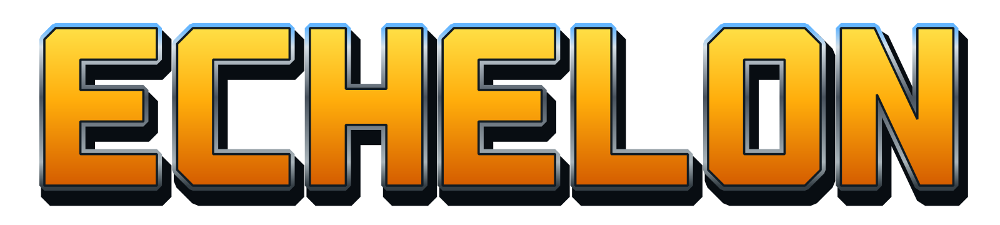

<p align="center">
  
</p>

<p align="center">
  <strong>Generals и Zero Hour. Один командный центр.</strong><br>
  Лаунчер и движок с открытым исходным кодом для Linux и macOS.
</p>

<p align="center">
  <a href="docs/HOWTO/INSTALLATION.md">Установка</a> ·
  <a href="docs/HOWTO/ECHELON_LAUNCHER.md">Руководство</a> ·
  <a href="https://github.com/Cheviiot/Echelon/issues">Сообщить о проблеме</a>
</p>

<p align="center">
  <a href="https://github.com/Cheviiot/Echelon/actions/workflows/ci.yml"></a>
</p>

## Две игры — одно приложение

**Echelon (Эшелон)** объединяет **Command & Conquer: Generals** и **Zero Hour** в одном приложении на основе кроссплатформенного движка [GeneralsX](https://github.com/fbraz3/GeneralsX).

- **Переключение между играми** — возвращайтесь в лаунчер, не закрывая приложение.
- **Локальные моды** — импортируйте модификации, патчи и дополнения, выбирайте версии и порядок загрузки.
- **Раздельные профили** — свои настройки, сохранения и наборы модов для каждой игры.
- **Два языка интерфейса** — русский и английский.

## Начало работы

Проект активно развивается: **Flatpak для Linux** и **сборка для Apple Silicon на macOS**. Начните с [инструкции по установке](docs/HOWTO/INSTALLATION.md), затем укажите папки с данными игр при первом запуске. Echelon копирует файлы, сохраняя оригиналы. Настройки и сохранения находятся в `~/.Echelon`.

**Нужна собственная копия игр.** Игровые данные в комплект не входят. Результаты проверок и текущие ограничения, включая совместимость реплеев, приведены в [отчёте о проверке](docs/WORKDIR/reports/ECHELON_FOUNDATION.md#executed-validation).

## Сборка из исходников

Подготовьте [среду сборки](docs/WORKDIR/reports/ECHELON_FOUNDATION.md#build-environment), затем соберите лаунчер и оба движка:

```bash
git clone --recurse-submodules https://github.com/Cheviiot/Echelon.git
cd Echelon
cmake --preset linux64-deploy -DRTS_BUILD_UNIVERSAL_LAUNCHER=ON
cmake --build build/linux64-deploy --target echelon_launcher
```

Готовое приложение: `build/linux64-deploy/Echelon/Echelon`. На macOS используйте пресет `macos-vulkan` и соответствующий каталог сборки.

## Репозиторий

| Ветка | Назначение |
| :--- | :--- |
| `main` | Echelon: наши исходники в корне, интегрированный движок в `GeneralsX/`. |
| [`upstream`](https://github.com/Cheviiot/Echelon/tree/upstream) | Защищённая история оригинального GeneralsX без наших изменений. |

Обновления движка принимаются через проверяемые слияния. Подробнее — в [правилах работы с upstream](UPSTREAM.md).

## Благодарности и лицензия

В основе проекта — [GeneralsX](https://github.com/fbraz3/GeneralsX), работа [TheSuperHackers](https://github.com/TheSuperHackers/GeneralsGameCode) и кроссплатформенные разработки [Fighter19 и feliwir](https://github.com/Fighter19/CnC_Generals_Zero_Hour). Авторство и история исходного кода сохранены.

Лицензия — [GNU GPL v3 или более поздняя](LICENSE.md). Независимый проект сообщества, не связанный с Electronic Arts. Command & Conquer и связанные товарные знаки принадлежат их правообладателям.
